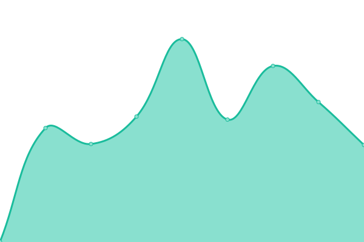
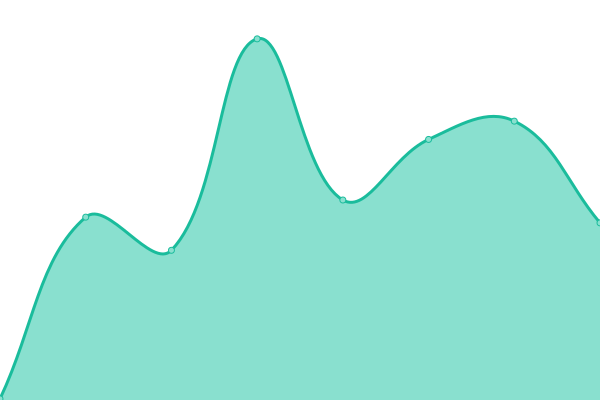

# [📈 Live Status](https://moximoti.github.io/upptime): <!--live status--> **🟩 All systems operational**

This repository contains the open-source uptime monitor and status page for [Timo Volkmann](https://moximoti.github.io/upptime), powered by [Upptime](https://github.com/upptime/upptime).

With [Upptime](https://upptime.js.org), you can get your own unlimited and free uptime monitor and status page, powered entirely by a GitHub repository. We use [Issues](https://github.com/moximoti/upptime/issues) as incident reports, [Actions](https://github.com/moximoti/upptime/actions) as uptime monitors, and [Pages](https://moximoti.github.io/upptime) for the status page.

<!--start: status pages-->
<!-- This summary is generated by Upptime (https://github.com/upptime/upptime) -->
<!-- Do not edit this manually, your changes will be overwritten -->
<!-- prettier-ignore -->
| URL | Status | History | Response Time | Uptime |
| --- | ------ | ------- | ------------- | ------ |
|  [DSM](https://dsm.timovolkmann.de) | 🟩 Up | [dsm.yml](https://github.com/moximoti/upptime/commits/HEAD/history/dsm.yml) | 

 1454ms
     
 | 

<a href="https://moximoti.github.io/upptime/history/dsm">100.00%</a>
    

|  [Minio](https://minio.timovolkmann.de/minio/health/live) | 🟩 Up | [minio.yml](https://github.com/moximoti/upptime/commits/HEAD/history/minio.yml) | 

 743ms
     
 | 

<a href="https://moximoti.github.io/upptime/history/minio">100.00%</a>
    

|  [Gitea](https://git.timovolkmann.de) | 🟩 Up | [gitea.yml](https://github.com/moximoti/upptime/commits/HEAD/history/gitea.yml) | 

 699ms
     
 | 

<a href="https://moximoti.github.io/upptime/history/gitea">100.00%</a>
    

|  [Das Quartier](https://dasquartier.org) | 🟩 Up | [das-quartier.yml](https://github.com/moximoti/upptime/commits/HEAD/history/das-quartier.yml) | 

 889ms
     
 | 

<a href="https://moximoti.github.io/upptime/history/das-quartier">100.00%</a>
    

|  [Das Quartier CMS](https://cms.dasquartier.org) | 🟩 Up | [das-quartier-cms.yml](https://github.com/moximoti/upptime/commits/HEAD/history/das-quartier-cms.yml) | 

 799ms
     
 | 

<a href="https://moximoti.github.io/upptime/history/das-quartier-cms">100.00%</a>
    

|  [t10n Services: Dynamic Image CDN (Das Quartier)](https://dq-images.t10n.de) | 🟩 Up | [t10n-services-dynamic-image-cdn-das-quartier.yml](https://github.com/moximoti/upptime/commits/HEAD/history/t10n-services-dynamic-image-cdn-das-quartier.yml) | 

 161ms
     
 | 

<a href="https://moximoti.github.io/upptime/history/t10n-services-dynamic-image-cdn-das-quartier">100.00%</a>
    

<!--end: status pages-->

[**Visit our status website →**](https://moximoti.github.io/upptime)

## 📄 License

- Powered by: [Upptime](https://github.com/upptime/upptime)
- Code: [MIT](./LICENSE) © [Timo Volkmann](https://moximoti.github.io/upptime)
- Data in the `./history` directory: [Open Database License](https://opendatacommons.org/licenses/odbl/1-0/)
